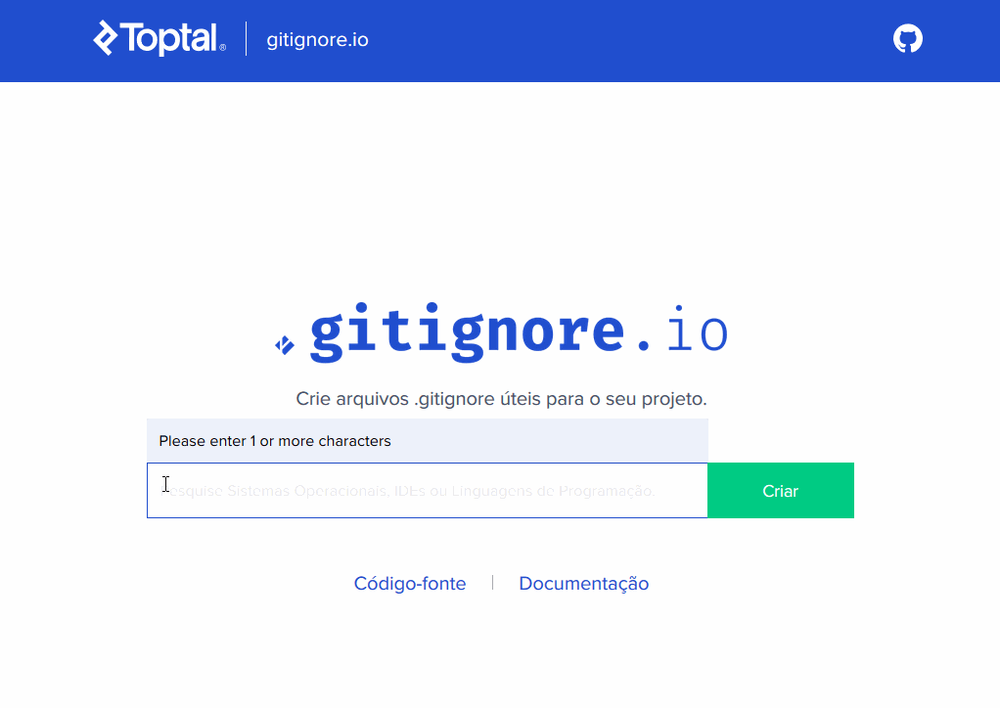
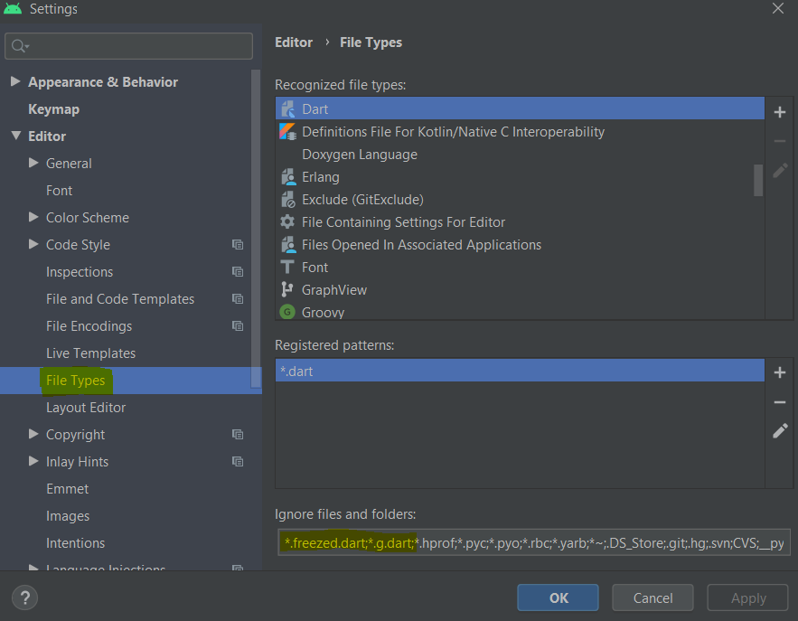

Com certeza todo desenvolvedor já vivenciou algo parecido com esse algoritmo:

1. Surgiu a grande ideia pra o próximo projeto da semana
2. Criar um novo repositório
3. Criar um projeto flutter novo no Android Studio
4. Configurar:
    * .gitignore 
    * pubspec.yaml
    * analysis_options.yaml
    * definir a estrutura de diretórios básica
    * etc
5. Ler artigos sobre [nome de ferramenta] …
6. Acabou a semana, voltar ao passo 1!

Normalmente é assim que muitos projetos nascem e morrem, mas se não podemos garantir que seja diferente, pelo menos podemos diminuir o retrabalho e ganhar o bem mais precioso que existe: tempo.

Logo, o melhor a fazer é criar um projeto boilerplate, principalmente se as ferramentas e configurações necessárias a todo novo projeto são praticamente as mesmas sempre. Isso ajuda no projeto inicial caso se tenha uma nova ideia em mente, mas sem perder tempo arrumando a casa do zero toda hora.

# Boilerplate, o que ser isso?

Podemos descrever a expressão boilerplate como uma forma padrão de se escrever algo que pode ser copiado. O termo deriva da fabricação de aço, onde boilerplate é o aço laminado em grandes placas para uso em caldeiras a vapor. Sendo assim, um código boilerplate presume-se que ele já foi testado inúmeras vezes e é tão consistente quanto o aço.

Desta forma, se já tivéssemos no GitHub um boilerplate então seria só o caso de executar o comando de <a href="https://help.github.com/pt/enterprise/2.19/user/github/creating-cloning-and-archiving-repositories/creating-a-repository-from-a-template" target="_blank">Criar repositório a partir do modelo</a>. 

## Gerando o repositório básico

É claro que poderíamos ir no GitHub criar o repositório vazio, depois criar localmente um diretório, iniciar o git, comitar e publicar. Tantos comandos que a preguiça pede a criação de um script só pra isso :grinning:

```powershell
:: Guima Coders - gitinit.bat
:: Inicializa um diretório com Git além de criar o repositório no GitHub
:: Copyright 2020 Fábio Guimarães
:: MIT License
@echo off
set USERNAME=%1
set REPONAME=%2
:: cria repositorio no github
call curl -u %USERNAME% https://api.github.com/user/repos -d '{"name":"'%REPONAME%'"}'
:: cria o repositorio local e inicia o git
md %REPONAME%
call git init
:: define usuario/password em cache
call git config credential.helper cache
:: adiciona/remove/modifica todos os arquivos para o git
call git add -A
:: comita
call git commit -m "first commit"
:: configura o repositorio local ao remoto
call git remote rm origin
call git remote add origin https://github.com/%USERNAME%/%REPONAME%.git
:: publica o repositorio
call git push -u origin master
```

E depois de escrever qualquer coisa nova nesse projeto seria só o caso de executar o segundo nível de preguiça:

```powershell
:: Guima Coders - gitupd.bat
:: Atualiza um diretório com Git e publica no GitHub
:: Copyright 2020 Fábio Guimarães
:: MIT License
@echo off
set MENSAGEM=%1
:: adiciona/remove/modifica todos os arquivos para o git
call git add -A
:: comita
call git commit -m %1
:: publica o repositorio sobreescrevendo
call git push origin master -f
```
# Criando o projeto Flutter apenas uma vez

Dentre as opções para criar o nosso novo projeto Flutter no repositório temos:
a) ou executar pelo terminal flutter create
b) ou criar utilizando o assistente do Android Studio equivalente ao flutter create

Seja qual for a escolha, no final teremos uma árvore de diretórios e arquivos parecidos com este abaixo:
```.
appname
├── .dart_tool
|   └── ...
├── .idea
|   └── ...
├── android
|   └── ...
├── ios
|   └── ...
├── lib
|   └──main.dart
├── test
|   └──widget_test.dart
├──.gitignore
└──pubspec.yaml
 ```
 
 Vamos analisar os arquivos no diretório raiz do projeto e os diretorios `lib/` e `test/`.

## Configurando o .gitignore 

Quando trabalhamos em uma equipe aonde IDE’s, editores e até talvez ambientes possam ser diferentes, é comum aparecer vários tipos de arquivos de configuração do projeto, ferramentas e outros.

A maioria acaba colocando a referência destes arquivos no .gitignore do projeto, o que já é muito bom, porque a configuração da IDE, não deve ser versionada em conjunto com o projeto. Essa tarefa deve ser feita mesmo quando o projeto será feito pela famosa equipe-de-um-homem-só.

Entretando ao analisarmos nosso diretorio raiz percebe-se que o arquivo .gitignore já foi gerado. E é claro que poderiamos ficar satisfeitos com esse básico mas ainda assim temos muita gordura em nossa estrutura para queimar.

O próprio Github possui um repositorio com uma coleção de arquivos .gitignore padrão por linguagem bem amplo que no caso da linguagem Dart se encontra em https://github.com/github/gitignore/blob/master/Dart.gitignore mas uma opção bem completa e prática é o gerado pelo <a href="https://gitignore.io" target="_blank">gitignore.io</a>. Exemplificando:



O resultado final também pode ser conferido em https://www.toptal.com/developers/gitignore/api/androidstudio,dart,flutter

## Configurando o analysis_options.yaml

Esse é bem fácil e eu realmente não entendo o por que de não ser gerado automaticamente pelo flutter. Entendo que é questão de gosto seguir o default, pedantic ou effective_dart. Minha preferencia segue abaixo:

```yaml

include: package:effective_dart/analysis_options.yaml

analyzer:
  errors:
    # treat missing required parameters as a error (not a hint)
    missing_required_param: error
    # treat missing returns as a warning (not a hint)
    missing_return: warning    
  strong-mode:
    implicit-casts: false
    implicit-dynamic: false
linter:
  rules:
    # Desligados do effective_dart
    lines_longer_than_80_chars: false
    one_member_abstracts: false
    # Extras ao effective_dart
    always_declare_return_types: true
    always_put_control_body_on_new_line: true
    avoid_empty_else: true
    avoid_relative_lib_imports: true
    avoid_renaming_method_parameters: true
    cancel_subscriptions: true
    control_flow_in_finally: true
    empty_catches: true
    empty_statements: true
```

Existe também a opção de adicionar ao `analysis_options.yaml` linhas para excluir arquivos criados por `built_value` e a maioria dos generators:

```yaml
(...)
analyzer:
  exclude:
    # ignore warnings in files from json_serializable, built_value and most generators
    - "**/*.g.dart"
    # ignore warnings in files generated by Freezed specifically.
    - "**/*.freezed.dart"
(...)
```
Entretanto prefiro colocar essas exceções direto no Android Studio em `Settings>File Types>Dart` como destaco abaixo:


## Configurando o pubspec.yaml

Em um relato anterior  descrevi alguns pacotes interessantes e cada um de nós pode montar um pubspec.yaml básico como esse a seguir:

```yaml
(...)
dependencies:
  (...)
  # Service locator
  get_it: ^4.0.2
  # Bloc for state management
  flutter_bloc: ^4.0.1
  # Functional programming thingies
  dartz: ^0.9.1
  # Remote API
  data_connection_checker: ^0.3.4
  http: ^0.12.1
  # Local cache
  shared_preferences: ^0.5.7+3
  # Code generator for unions/pattern-matching/copy
  # Annotations for freezed.
  freezed_annotation: ^0.11.0
  # JSON
  json_annotation: ^3.0.1
  # many icons veja em https://oblador.github.io/react-native-vector-icons/
  flutter_icons: ^1.1.0
(...)
dev_dependencies:
  (...)

  # Linter rules corresponding to the guidelines in Effective Dart.
  effective_dart: ^1.2.2
  # Mock library
  mockito: ^4.1.1
  # provides a concrete way of generating files using Dart code
  build_runner: ^1.10.0
  # Code generator for unions/pattern-matching/copy
  # No [terminal] executar "flutter pub pub run build_runner build" para gerar os arquivos
  freezed: ^0.11.2
  json_serializable: ^3.3.0
(...)
```
## Sobre a estrutura de diretorios `lib/` e `test/`

Como proposto por <a href="https://blog.cleancoder.com/uncle-bob/2012/08/13/the-clean-architecture.html" target="_blank">Uncle Bob</a> vamos partir de uma estrutura que separe a codificação em camadas independentes e dependa de abstrações em vez de implementação concretas.

```.
[nome do recurso]
├── data
|   ├── data_sources
|   ├── models
|   └── repositories
├── domain
|   ├── entities
|   ├── use_cases
|   └── repositories
└── presentation
    ├── manager
    ├── pages
    └── widgets
```

A estrutura acima pode ser gerada facilmente em `lib/` e `test/` no Android Studio pelo plugin <a href="https://plugins.jetbrains.com/plugin/13470-clean-architecture-for-flutter" target="_blank">Clean Architecture for Flutter</a>

# O segredo da felicidade: atualize sempre

Um bom costume para ser feliz é, sempre que se começar um novo projeto, gastar um pequeno tempo revisando e atualizando os templates caso seja necessário. Afinal um boilerplate de meses atras pode estar obsoleto.

Espero que esse relato no mínimo seja usado no futuro para referência ou sirva de inspiração para a criação de seu próprio boilerplate!

A versão mais atualizada que criei/utilizo pode ser encontrada em xpto.

# Mensagem final genérica

> Não deixe que o barulho das opiniões dos outros afunde sua própria voz interior. 
> <cite>Steve Jobs[^1]</cite>

[^1]: <a href="https://www.azquotes.com/quote/458474" title="Steve Jobs quote"></a>